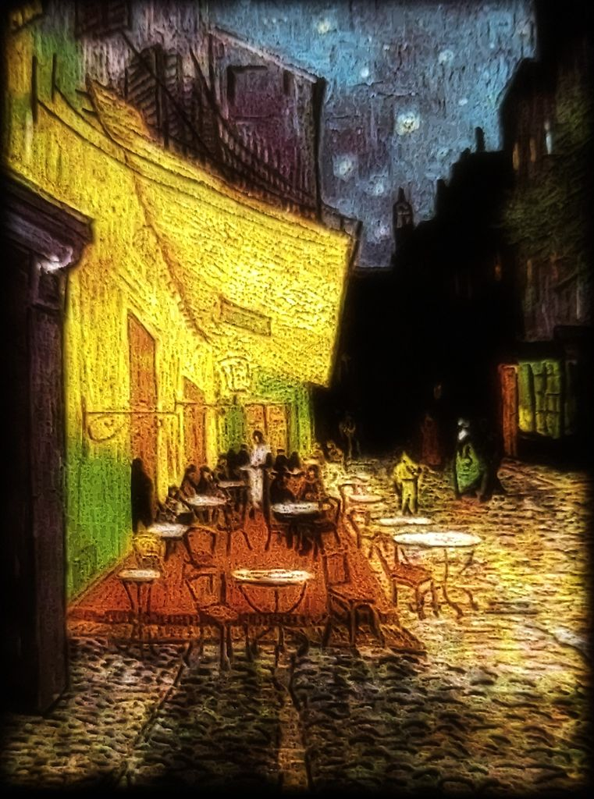
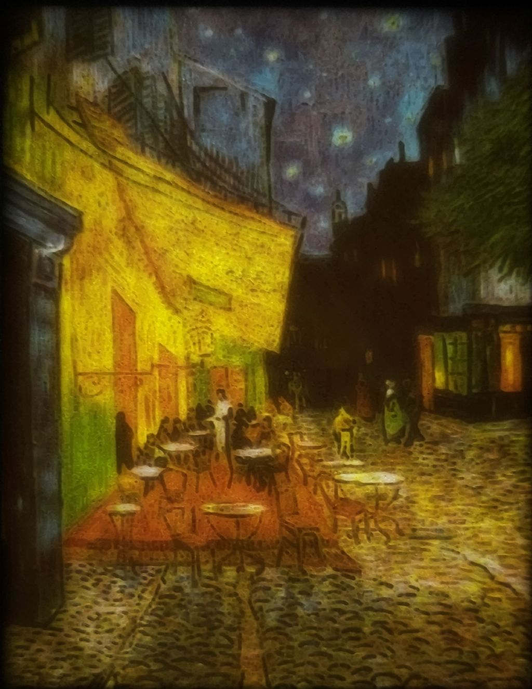
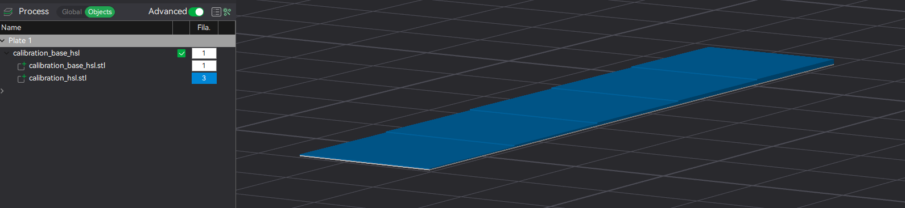
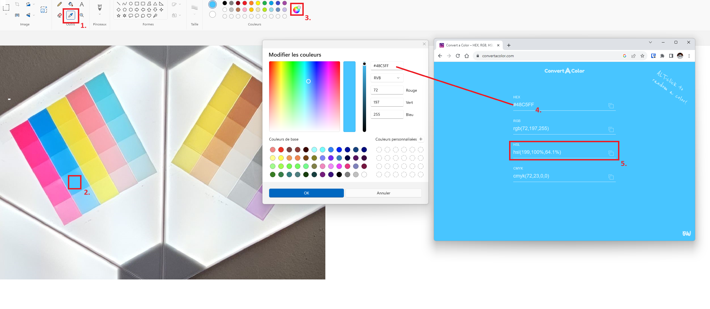

# PIXEstL
A program for creating color lithophane and pixel images.
The program relies on a color palette that can be customized by adding its own filaments. This allows for the creation of lithophanes with an infinite variety of filaments.

The filaments can be added to the palette in two ways:

By adding the color of the raw filament (for creating pixel art images).
By adding the chromatic characteristics of the different layers of your filament (for creating lithophanes).

For example for lithophanes, in addition to the usual Cyan, Magenta, and Yellow filaments, the palette allows for the addition of Black (for achieving deep black), or simply adding lighter CMY shades (in addition to the usual ones) to enrich the color palette.

## Usage
```usage: PIXEstL
usage: PIXEstL
 -b,--colorPixelLayerThickness <arg>   Thickness of each color pixel layer (mm). Default: 0.1
 -c,--colorNumber <arg>                Maximum number of color number by layer. Default: no limits
 -C,--curve <arg>                      Curve parameter. Default: no curve
 -cW,--colorPixelWidth <arg>           Width of color pixels (mm). Default: 0.8
 -d,--colorDistanceComputation <arg>   Method for pixel color distance computation [RGB,CIELab]. Default: CIELab
 -F,--pixelCreationMethod <arg>        Method for pixel creation [ADDITIVE,FULL]. Default: ADDITIVE
 -f,--plateThickness <arg>             Thickness of the plate (mm). Default: 0.2
 -i,--srcImagePath <arg>               Path to the source image.
 -l,--colorLayerNumber <arg>           Number of color pixel layers. Default: 5
 -M,--textureMaxThickness <arg>        Maximum thickness of the texture (mm). Default: 2.5
 -m,--textureMinThickness <arg>        Minimum  thickness of the texture (mm). Default: 0.2
 -n,--layerThreadMaxNumber <arg>       Maximum number of threads for layers generation. Default: 1 by STL layer
 -N,--rowThreadMaxNumber <arg>         Number of threads for rows generation. Default: number of cores available
 -o,--destZipPath <arg>                Destination ZIP file path. Default: <-image>.zip
 -p,--palettePath <arg>                Path to the palette file.
 -t,--layerThreadTimeout <arg>         Timeout for layer threads (second). Default: 120
 -T,--rowThreadTimeout <arg>           Timeout for row threads (second). Default : 60
 -tW,--texturePixelWidth <arg>         Width of texture pixels (mm). Default: 0.25
 -w,--destImageWidth <arg>             Width of the destination image (mm).
 -X,--debug                            Debug mode
 -z,--colorLayer <arg>                 Color layers will generate or not. Default : true
 -Z,--textureLayer <arg>               Texture layers will generate or not. Default : true
```
## Quick Start (to quickly test the program)
- Go to [Releases section](https://github.com/gaugo87/PIXEstL/releases/latest) and download the last "PIXEstL-XXX.zip" file
- Install Java. Ideally this version https://www.oracle.com/fr/java/technologies/downloads/#java17 (heavier but faster in execution), otherwise this one https://www.java.com/fr/download/ (lighter but slower in execution).
- Unzip PIXEstL.zip
- Go to PIXEstL directory (unzipped directory)
- Execute sample.bat (double-click)
- Wait between a few seconds and a few minutes, depending on your processor.

A zip file has been generated (Cafe_Terrace_at_Night.zip) ? Congratulations! The program works!  
Open the generated zip file, to see the result... 

Then :  
- Edit and customize the file "sample.bat" with your parameters (for example, change the image path).  
- Edit and customize the file "filament-palette-0.10mm.json" for your filaments (for example, activate only 4 colors).

## YouTube tutorial channel (in French)


[](https://www.youtube.com/@PIXEstL-nb5cq)


## Examples of results

### Color lithophanes
``` 
java -jar PIXEstL.jar -p filament-palette-0.10mm.json -w 130 -d RGB -i Cafe_Terrace_at_Night.jpg
```


``` 
java -jar PIXEstL.jar -p filament-palette-0.10mm.json -w 150 -i mem.png
```


```
java -jar PIXEstL.jar -p filament-palette-0.10mm.json -w 150 -i starwars.jpg
```


### Color lithophane with small texture layer
``` 
java -jar PIXEstL.jar -p filament-palette-0.10mm.json -w 130 -d RGB -M 1.4 -i rainbow_infinity.png
``` 


### Lithophane with only texture layer
``` 
java -jar PIXEstL.jar -p filament-palette-0.10mm.json -M 3 -w 150 -z false -i tsunami_Hokusai.jpg
``` 


### Lithophane of a face with underexposure and overexposure to light
``` 
java -jar PIXEstL.jar -p filament-palette-0.10mm.json -w 100 -i Marilyn.jpg
```


### Lithophane with the new default color distance computation (CIELab)
``` 
java -jar PIXEstL.jar -p filament-palette-0.10mm.json -w 150 -M 1.5 -i Petals.jpg
```


### Lithophane from an image with transparency in the background
``` 
java -jar PIXEstL.jar -p filament-palette-0.10mm.json -w 400 -d RGB -M 2 -i butterfly.png 
```


### Lithophanes in black and white, with 3 filaments (Black, White and Silver)
``` 
java -jar PIXEstL.jar -p filament-palette-0.10mm.json -w 150 -cW 0.4 -i vegeta.jpg
```


### Lithophanes in 7 filaments with only 1 AMS (pool of 4 filaments)
``` 
java -jar PIXEstL.jar -p filament-palette-0.10mm.json -w 100 -M 1.7 -l 4 -c 4 -i Leon.png 
```


```
java -jar PIXEstL.jar -p filament-palette-0.10mm.json -w 100 -M 1.7 -l 4 -c 4 -i Cafe_Terrace_at_Night.jpg
```


### Pixel Art image (with only color layers + FULL colors)
``` 
java -jar PIXEstL.jar -p filament-palette-0.10mm.json -w 200 -c 8 -F FULL -Z false -cW 2 -l 2 -f 1 -d RGB -i tsunami_Hokusai.jpg
```


### Others lithophanes
<table>
<tr>

<td></td>
<td></td>
<td></td>
<td></td>
<td></td>
<td></td>
<td></td>
</tr>
</table>


## The palette

The palette is composed of a JSON structure that gathers all the filaments you have.
```
"#0086D6":
{
  "name": "Cyan[PLA Basic]",
  "active": true,
  "layers": {
    "5": {
      "H": 202.4,
      "S": 95,
      "L": 48
    },
    [...]
    "2": {
      "H": 202.4,
      "S": 95,
      "L": 69.6
    },
    "1": {
      "H": 202.4,
      "S": 81,
      "L": 79
    }
  }
}
```
- `"#0086D6"`: This is the key that identifies the filament. It is a hexadecimal value representing the filament's color.
  - `"name"`: "Cyan[PLA Basic]": This is the name of the filament. In this example, the name is "Cyan[PLA Basic]".
  - `"active"`: true: This is a boolean indicator to determine if the filament is active (true) or not (false).
  - `"layers"`: This is an object that contains the different layers of the filament.
    - `"5"`, `"4"`, etc. : These are the keys for each layer of the filament. Each layer has an associated number. (Ex: 0.5mm, 0.4mm, 0.3mm if you work with layers of 0.1mm )  
    "H", "S", "L": These are the chromatic properties of each layer.
      - "H" represents the hue value of the layer.
      - "S" represents the saturation value of the layer.
      - "L" represents the lightness value of the layer.

The fields `#XXXXXX`, `name`, and `active` are mandatory. They allow for creating pixel art images.  
The `layers` field is required for the filament to be used in creating color lithophanes through color addition.
The code `#FFFFFF` filament is mandatory to be used in creating color lithophanes through color addition (but th HSL values can be changed).

Palette composed of BambuLab filaments, with 0.10mm layers :  [filament-palette-0.10mm.json](palette/filament-palette-0.10mm.json)

### How to calculate the chromatic properties of the layers of your filament

1. Create squares in your slicer with the desired thickness, representing the different desired layers. For example, if you are working with 0.1mm layers, create a square with a thickness of 0.1mm, another one with 0.2mm, then 0.3mm, 0.4mm, and 0.5mm.  
   A sample of calibration square in 0.1mm is present [here](tools/calibration/)
2. Print the squares using the appropriate filament.  
     
   And the appropriate print settings (infill 100%. layer height and first layer height at 0.1/0.12, etc. )

   **Note:** Ironing is recommended to achieve a smoother and more uniform surface. This makes it easier to take measurements. 
3. Place the squares in front of a neutral light source and take photos of them.
4. Open with your favorite editor the photos (e.g., "Paint") and use the color picker tool to extract the color.
5. Optionally, convert the hexadecimal color to HSL if your editing software does not provide HSL values (e.g., use a tool like https://convertacolor.com/).
   
6. Enter these HSL values for each layer in the palette.
```
    "2": {
      "H": 199,
      "S": 100,
      "L": 64.1
    },
```
## Recommended parameters for a 0.2mm nozzle (default)
``` 
java -jar PIXEstL.jar -p filament-palette-0.10mm.json -i ...
``` 
## Recommended parameters for a 0.4mm nozzle
``` 
java -jar PIXEstL.jar -p filament-palette-0.10mm.json -f 0.24 -b 0.12 -i ...
``` 

## Recommended parameters for a print in 7 colors with only an AMS with 4 colors
``` 
java -jar PIXEstL.jar -p filament-palette-0.10mm.json ... -c 4 -l 4
``` 

## Execution result
Running the program generates a zip file that contains:
- image-color-preview.png : color preview (image used to generate colors)
- image-texture-preview.png : a preview of the texture (image used for texture layer)
- layer-\<color>.stl * the number of color
- layer-plate.stl
- layer-texture-White.stl

Example :  


## Slicing procedure
### Print settings

- Nozzle : 0.2mm (or 0.4mm)
- Layer height : 0.10mm (or 0.12mm)
- Infill density : 100%

### Example with Bambu Studio
- Open Bambu Studio
- Import new STL files (CTRL+i)
- Select all generated STl files  
  
- Click on "Yes" for the question "load these files as a single object with multiple parts"  
  
- Setting adjustments:
  - a 0.2 nozzle (or a 0.4 nozzle)
  - a 0.10mm setting (or a 0.12mm for a 0.4 nozzle)
  - Spare infill density : 100%   
  
  
- Go to the "Objects" tab and associate the layers with the color filaments  
  

## Binary generation
### Prerequisites
- Java JDK (ex: https://www.oracle.com/fr/java/technologies/downloads/)
- Maven (https://maven.apache.org/download.cgi)

### Compilation
``` 
cd PIXEstL
set JAVA_HOME=C:\Program Files\Java\jdk-20
set MAVEN_HOME=C:\Program Files\apache-maven-3.3.1
mvn clean install
```

